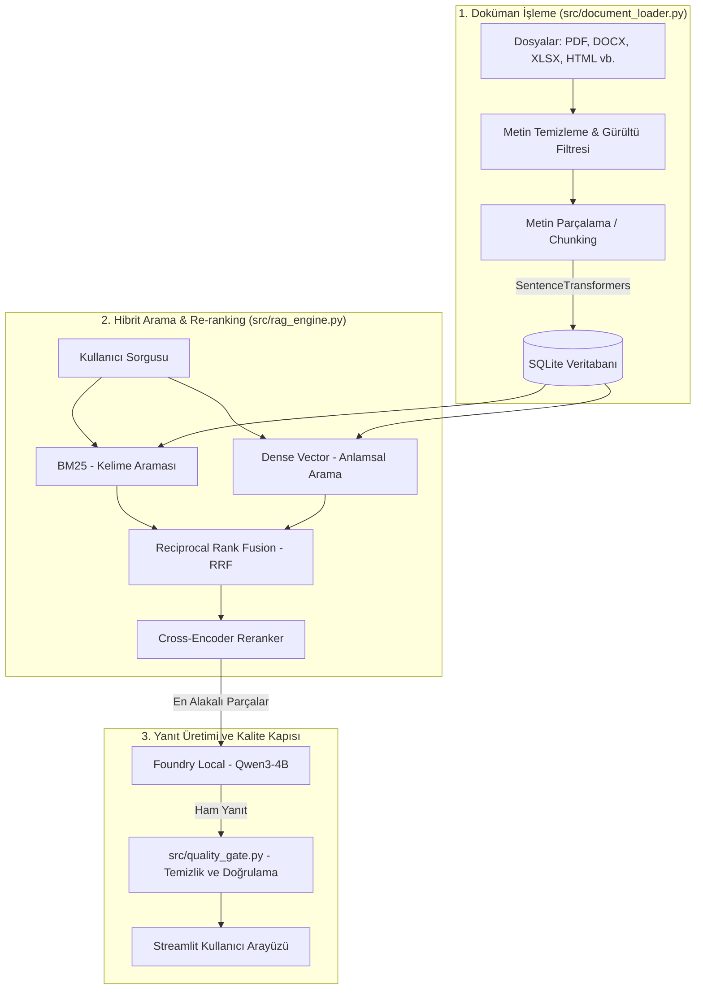

# Yerel RAG Saha ve Teknik Doküman Asistanı

Microsoft Foundry Local üzerinde çalışan, internet bağlantısı olmadan tamamen yerel donanımda (GPU/CPU) işleyen RAG (Retrieval-Augmented Generation) belge asistanı. Saha hizmetleri, teknik bakım-onarım dokümanları ve gizli kurumsal verileri buluta çıkarmadan sorgulamak için geliştirildi.

---

## Neden?

| Problem | Bu Projedeki Çözüm |
| :--- | :--- |
| **Gizli veriler buluta yüklenemez** | Çıkarım (inference) ve gömme (embedding) tamamen Microsoft Foundry Local ile cihazda yapılır, dışarıya tek bir ağ isteği gitmez. |
| **Sadece vektör araması teknik terimleri/kodları kaçırır** | **BM25 + Yoğun Vektör (Dense) + RRF + Cross-Encoder Re-ranker** ile iki aşamalı hibrit arama yapılır. |
| **Modellerin düşünme etiketleri (`<think>`) ve tekrarları** | `src/quality_gate.py` katmanı ile CoT çıktıları temizlenir, döngüsel yanıtlar tespit edilip düzeltilir. |
| **Sadece PDF veya TXT yetersizliği** | `PDF`, `DOCX`, `XLSX`, `PPTX`, `CSV`, `HTML` ve `TXT` formatlarından doğrudan metin ve yapı ayıklanır. |

---

## Mimari ve Arama Pipeline'ı



---

## Tasarım Kararları ve Deneyimler

* **Neden Cross-Encoder Re-ranker?**  
  Arama tarafında sadece vektör veya sadece BM25 kullanmak teknik dokümanlarda yetersiz kalıyordu. RRF (Reciprocal Rank Fusion) ile iki sıralamayı birleştirdikten sonra, `cross-encoder/mmarco-mMiniLMv2-L12-H384-v1` modelini sürece dahil ettim. Cross-encoder, sorgu ile metin parçasını tek bir doğrultuda beraber işlediği için en alakalı ilk 3-5 parçayı seçmede isabet oranını belirgin şekilde artırdı.

* **Düşünme Etiketleri (`<think>`) ve Yanıt Kalitesi (`src/quality_gate.py`):**  
  Qwen3 ve benzeri modeller içsel düşünme süreçlerini (`<think>...</think>`) yanıt metnine dahil edebiliyor. `src/quality_gate.py` modülü ile bu etiketler arayüze yansımadan düzenli ifadelerle temizlenir. Ayrıca modelin kendini tekrara soktuğu (halüsinasyon/döngü) durumlar algılanarak yanıt otomatik revize edilir.

* **Sıfır Dış Bağımlılıklı Veritabanı (SQLite):**  
  Ayrı bir vektör veritabanı sunucusu (Qdrant, Chroma vb.) kurma zorunluluğunu ortadan kaldırmak için metin parçaları, meta veriler ve vektör gömmeleri yerel bir `SQLite` veritabanında saklanır.

* **Arayüzde Şeffaf Tanı Paneli (Diagnostics):**  
  Streamlit arayüzünde modelin cevabı üretirken hangi metin parçalarından beslendiği; bu parçaların **BM25 skoru**, **Vektör Benzerliği** ve **Re-rank Puanı** ile birlikte genişletilebilir panellerde şeffafça gösterilir.

---

## 📊 Benchmark & Değerlendirme Test Sonuçları (`eval/evaluate.py`)

Sistemin getirme (retrieval), re-ranking ve doğru ret (rejection) performansı `eval/evaluate.py` betiği üzerinden literatür standartlarına uygun 6 farklı senaryoda otomatik olarak ölçülmüştür:

| Metrik | Elde Edilen Sonuç | Açıklama |
| :--- | :---: | :--- |
| **Getirme İsabet Oranı (Hit Rate)** | **%100.0** | Aranan bilginin ilk sonuçlar arasında bulunma yüzdesi |
| **Sıralama Kalitesi (MRR@K)** | **0.875 / 1.000** | En alakalı bilginin 1. sırada getirilme başarısı (Mean Reciprocal Rank) |
| **Doğru Ret Başarısı (Rejection)** | **%100.0** | Dokümanda olmayan veya kapsam dışı sorguları tespit etme oranı |
| **Ortalama Arama Süresi (Latency)** | **0.521 saniye** | Sorgu başına ortalama getirme ve re-rank süresi |

### Senaryo Bazlı Test Detayları
1. **Anlamsal Arama (Semantic):** ✅ HIT (Sıra #1) | Süre: 2.295s | Puan: 1.743
2. **Kapsamlı Kod / BM25 Match (`PRT-9921`):** ✅ HIT (Sıra #1) | Süre: 0.215s | Puan: 7.034
3. **Çeldirici Modeller (`XYZ-5000` vs `XYZ-6000`):** ✅ HIT (Sıra #2) | Süre: 0.150s | Puan: 10.093
4. **Yazım Hatalı Sorgu (Typo Tolerance):** ✅ HIT (Sıra #1) | Süre: 0.147s | Puan: 0.332
5. **Kapsam Dışı (Out of Domain):** ✅ REJECTED | Süre: 0.155s | Puan: -2.773
6. **Dokümanda Olmayan Detay:** ✅ REJECTED | Süre: 0.163s | Puan: -1.922

---

## Proje Yapısı

```text
local-rag-assistant/
├── app.py                 # Streamlit arayüzü ve sohbet akışı
├── src/                   # Uygulama ana modülleri
│   ├── config.py          # Sistem ayarları ve dinamik Foundry port kontrolü
│   ├── document_loader.py # Çoklu format metin okuma ve gürültü filtresi
│   ├── quality_gate.py    # CoT etiket temizliği, döngü tespiti ve yanıt revizyonu
│   └── rag_engine.py      # BM25, Vektör arama, RRF, Re-ranker ve SQLite yönetimi
├── eval/                  # Performans ölçüm ve benchmark modülleri
│   ├── evaluate.py        # Metrik hesaplama ve test betiği
│   └── sample_field_manual.txt # Sentetik test kılavuz dokümanı
├── requirements.txt       # Bağımlılıklar
└── data/                  # Yerel veri alanı (.gitignore ile korunur)
    ├── index/             # SQLite veritabanı (rag.sqlite3)
    └── raw/               # Yüklenen geçici dokümanlar
```

---

## Kurulum ve Çalıştırma

### 1. Gereksinimler ve Depoyu Klonlama

```bash
git clone [https://github.com/bthnozdemir/local-rag-assistant.git](https://github.com/bthnozdemir/local-rag-assistant.git)
cd local-rag-assistant

# Sanal ortam oluşturma ve aktifleştirme
python -m venv venv
.\venv\Scripts\Activate.ps1   # Linux/macOS için: source venv/bin/activate

# Bağımlılıkları yükleme
pip install -r requirements.txt
```

### 2. Microsoft Foundry Local Sunucusunu Başlatma

Çıkarım motorunun çalışabilmesi için Foundry Local servisinin açık ve ilgili modelin indirilmiş olması gerekir:

```bash
foundry server start
foundry model load qwen3-4b-cuda-gpu:2
```

### 3. Uygulamayı ve Benchmark Testini Çalıştırma

* **Streamlit Arayüzünü Başlatma:**
  ```bash
  streamlit run app.py
  ```
  Tarayıcıda otomatik olarak açılan `http://localhost:8501` adresinden doküman yükleyip sohbet etmeye başlayabilirsiniz.

* **Benchmark & Ölçüm Betiğini Çalıştırma:**
  ```bash
  python eval/evaluate.py
  ```

---

## Bilinen Sınırlılıklar

* **OCR Desteği:** Görsel tabanlı veya taranmış (scanned) PDF dosyaları için henüz OCR entegrasyonu bulunmamaktadır (sadece metin katmanı olan PDF'ler desteklenir).
* **Donanım İhtiyacı:** LLM çıkarımı yerel GPU üzerinde yapıldığından akıcı bir yanıt süresi için minimum 4 GB VRAM önerilir.

---

## Lisans

Bu proje [MIT Lisansı](LICENSE) altında sunulmaktadır.
